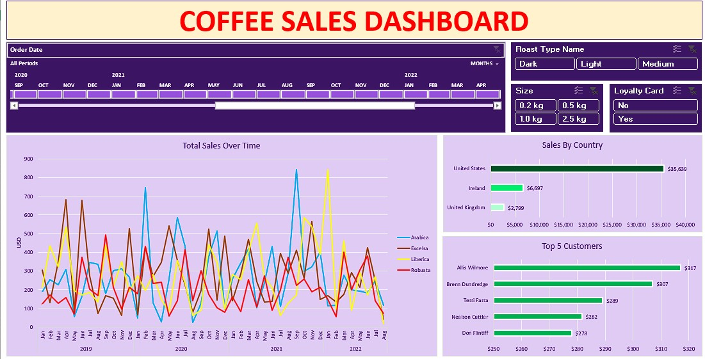
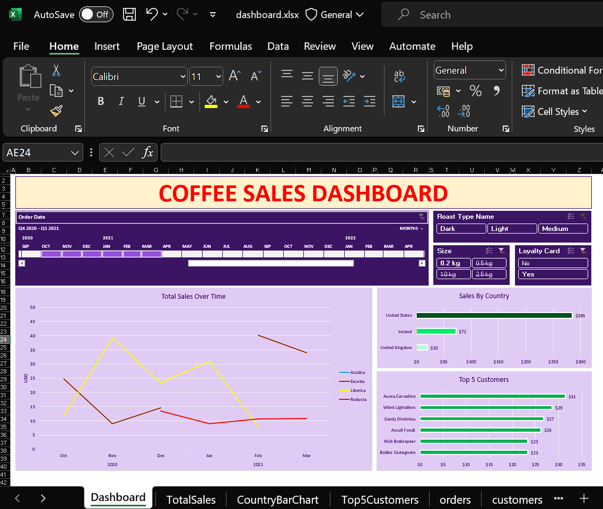

# Coffee-Market-Analytics

## Overview

Welcome to the Coffee Market Orders Data Analytics repository. This project involves analyzing the orders data of a coffee market using Microsoft Excel. The dataset comprises three primary tables: `orders`, `customers`, and `products`. The main objective is to create an insightful dashboard that illuminates various aspects of the coffee market's performance.

## Tables

### Orders Table

- **Order Date**
- **Customer ID**
- **Product ID**
- **Quantity**

### Customers Table

- **Customer ID**
- **Customer Name**
- **Email**
- **Phone Number**
- **Address Line 1**
- **City**
- **Country**
- **Postcode**
- **Loyalty Card**

### Products Table

- **Product ID**
- **Coffee Type**
- **Roast Type**
- **Size**
- **Unit Price**
- **Price per 100g**
- **Profit**

## Dashboard Features

The Excel dashboard provides detailed insights into various aspects of the coffee market orders:

1. **Sales Overview**
   - Tracks the Total Sales Over Time, breaking down by Months and Years.

2. **Roast Types Analysis**
   - Presents a comprehensive Sales Breakdown categorized by Roast Type (Dark, Light, Medium).

3. **Size Analysis**
   - Analyzes the Sales Breakdown based on Size (in kgs).

4. **Loyalty Card Impact**
   - Compares Loyalty Card Sales with Non-Loyalty Card Sales to gauge the impact of loyalty programs.

5. **Geographic Analysis**
   - Displays Sales by Country, providing a geographical perspective on market performance.

6. **Top Customers**
   - Identifies the Top 5 Customers based on their Total Sales contribution.

## Screenshots

<table align="center">
  <tr>
    <td></td>
  </tr>
  <tr>
     <td style="text-align: center;"><em>Dashboard</em></td>
  </tr>
</table>

<table align="center">
  <tr>
    <td></td>
  </tr>
  <tr>
     <td style="text-align: center;"><em>Dashboard</em></td>
  </tr>
</table>

## How to Use

1. **Download the Excel File**: Obtain the Excel file [`dashboard.xlsx`](dashboard.xlsx).
2. **Open in Microsoft Excel**: Launch the file using Microsoft Excel.
3. **Navigate to Dashboard**: Explore the comprehensive analytics on the "Dashboard" sheet.
 
For the live experience, visit  [website](https://shib1111111.github.io/Coffee-Market-Analytics/).
 
 

## Contributing

We welcome contributions to enhance this project. Feel free to open issues or submit pull requests.

## License

This project is licensed under the [MIT License](LICENSE).

Thank you for your review! Feel free to reach out with any questions or feedback.

<em style="color: #ff66b2; font-weight: bold;">✨ --- Designed & made with Love by Shib Kumar Saraf ✨</em>
